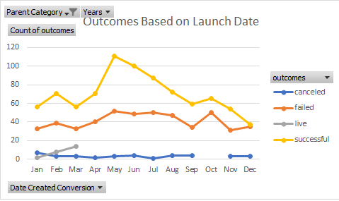
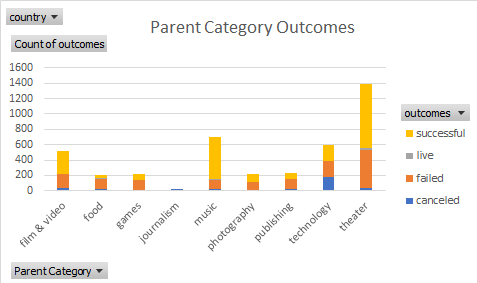

# Kickstarter-Analysis

Performing analysis on Kickstarter data to uncover trends

## Kickstarter Analysis Knowledge Findings 

In performing this analysis I learned the following skills: 

- How to View and Interpret Data Findings in Different Ways by using Pivot Tables and Pivot Charts

- How to Apply Filters, Conditional Formatting, & Formatting in a Methodical Way to Enhance Analysis and Characterize Data

- How to Apply Descriptive Statistics and Visualization Techniques to Refine Data and Highlight Trends/Outliers
		- **Please see below for an example of how I used Visualization Techniques in my Kickstarter Analysis to highlight trends based upon data set's respective Launch Date & [Parent] Category**

		

		

